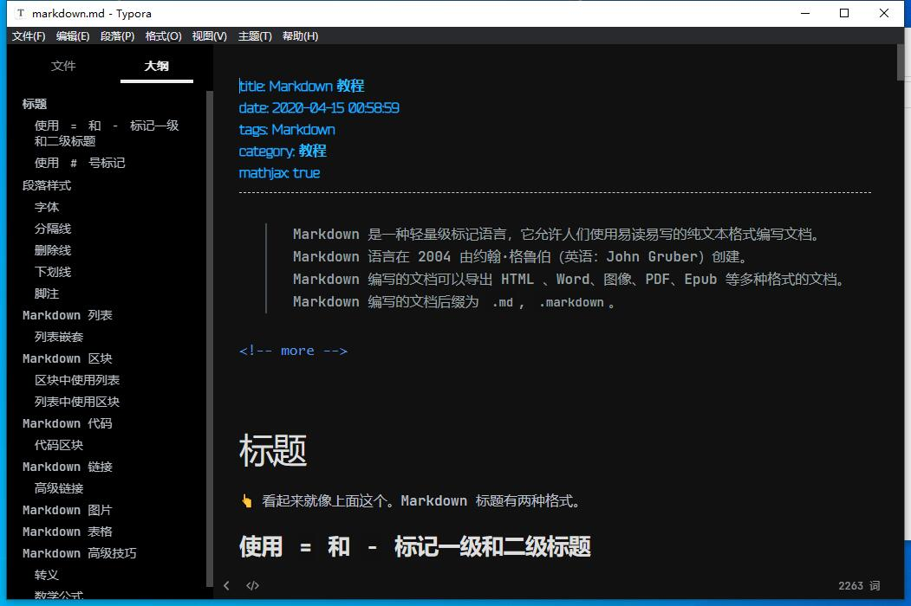
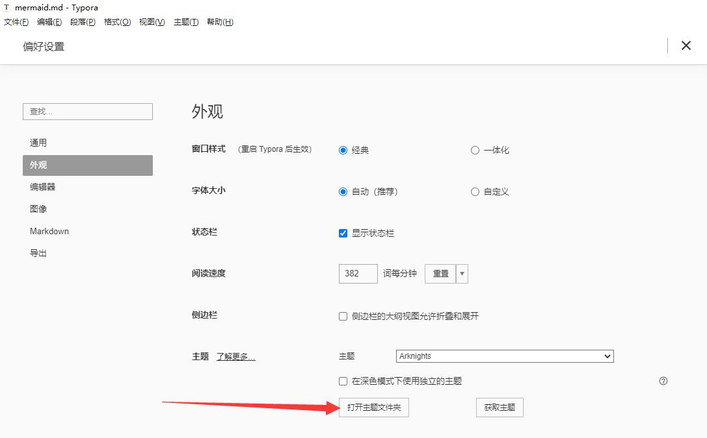
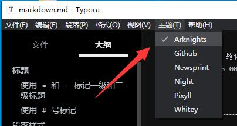

# typora-theme-arknights

## 安装

1. 执行 `git clone https://github.com/Yue-plus/typora-theme-arknights.git`

2. 点开 **文件** → **偏好设置** -> **外观** → **打开主题文件夹**：

   

3. 将 `arknights.css` 文件与 `arknights\` 目录复制到 **主题文件夹中**

4. 重启 Typora 后应用主题

   

5. [JetBrainsMono 字体](https://github.com/JetBrains/JetBrainsMono)，可以在 `arknights\JetBrainsMono-2.225\fonts\ttf` 目录中找到并在电脑上安装（可能不是最新版）。

> 参考 [安装主题](https://theme.typora.io/doc/Install-Theme/)

## 参与开发

> 点击 Typora 的 文件 > 偏好设置 > 通用 > 勾选“开启调试模式”
> 然后再文本编辑区右键会多出一个检查元素，然后就可以像在浏览器中调 css 一样

欢迎[提交反馈](https://github.com/Yue-plus/typora-theme-arknights/issues/new) & [发起 PR](https://github.com/Yue-plus/typora-theme-arknights/pulls)

### 可能需要的文档

- [如何為 Typora 撰寫客製化樣式](https://pjchender.github.io/2018/04/24/note-%E5%A6%82%E4%BD%95%E7%82%BA-typora-%E6%92%B0%E5%AF%AB%E5%AE%A2%E8%A3%BD%E5%8C%96%E6%A8%A3%E5%BC%8F/)
- [Write Custom Theme for Typora](http://theme.typora.io/doc/Write-Custom-Theme/)

> `html-preview` 文件夹源于 <https://github.com/typora/typora-theme-toolkit>

## 友情链接

- [hexo-theme-arknights](https://github.com/Yue-plus/hexo-theme-arknights)：Hexo 博客主题